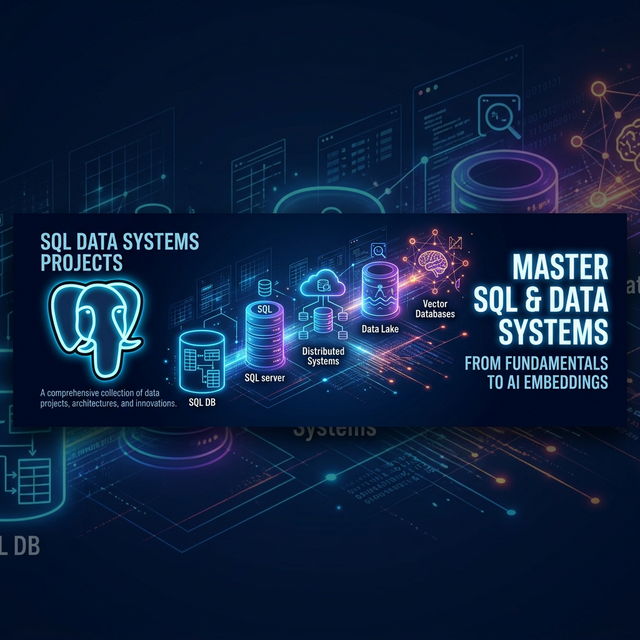

  

<h1 align="center">SQL Data Systems Projects</h1>

<h3 align="center">A Progressive Journey from Relational Fundamentals to AI-Powered Databases</h3>

  
  
  
  
  

---

## 🚀 About This Repository

This repository contains a curated series of **production-grade database engineering projects**. It is designed to demonstrate full-stack database mastery—starting from foundational schema design and progressing into advanced optimization, analytical reporting, and modern AI vector integrations.

Each project operates as a fully functional, highly documented system mimicking real-world data environments (University Systems, E-Commerce platforms, etc.).

---

## 🗺️ Project Series Roadmap

| # | Project | Domain | Complexity | Status |
|:-:|:--------|:-------|:-----------|:------:|
| 1 | 🎓 **[Student Management System](./project-1-student-management-basic/)** | University Academics | ⭐⭐ | ✅ Complete |
| 2 | 🛒 **[AI E-Commerce Platform](./project-2-ecommerce-database/)** | Online Retail + AI | ⭐⭐⭐⭐⭐ | ✅ Complete |
| 3 | 🤖 **Agent Memory Database** | AI Memory Systems | ⭐⭐⭐⭐⭐ | 🔜 Coming Soon |

---

### Project 1: Student Management System
A foundational academic data warehouse simulating 100,000+ student records.
- **Focus:** Schema normalization, foreign keys, constraints, and data generation using `generate_series()`.
- **Highlights:** 11 relational tables, multi-join analytical groupings, and 25 complex SQL queries broken into 5 difficulty levels.

### Project 2: AI-Ready E-Commerce Platform
An elite, highly optimized retail platform incorporating artificial intelligence directly into the database.
- **Focus:** Performance tuning (table partitioning, GIN/B-Tree indexing), triggers, materialized views, JSONB, and AI vectors.
- **Highlights:** 15M+ synthetic rows across 30 tables. Features `pgvector` for semantic similarity search, taste-profile centroid generation, and hybrid (text + vector) recommendations. Includes a massive Mermaid architecture flow diagram.

### Project 3: Agent Memory Database (Coming Soon)
A high-performance memory storage engine designed for LLM agents.
- **Focus:** Vector data structures, chat history graphs, hierarchical memory pruning.
- **Highlights:** Integrating state retention for autonomous systems using advanced graph-relational models.

---

## 🛠️ Technology Stack

- **Core Engine:** PostgreSQL 15+
- **Extensions:** `pgvector` (AI/Embeddings), `pg_trgm` (Text matching)
- **Data Types:** `JSONB`, `vector`, `tsvector`, `ENUM`
- **Features:** Table Partitioning, Window Functions, Triggers, Materialized Views

---

## 🤝 Contributing & Usage

Feel free to fork this repository or use these schemas to practice complex SQL queries, backend integrations, or data analysis workflows.

Detailed local spin-up instructions, architectural breakdowns, and entity-relationship diagrams can be found inside the `README.md` of each individual project folder.

---

  Built with ❤️ by Aman Bhaskar 

  

