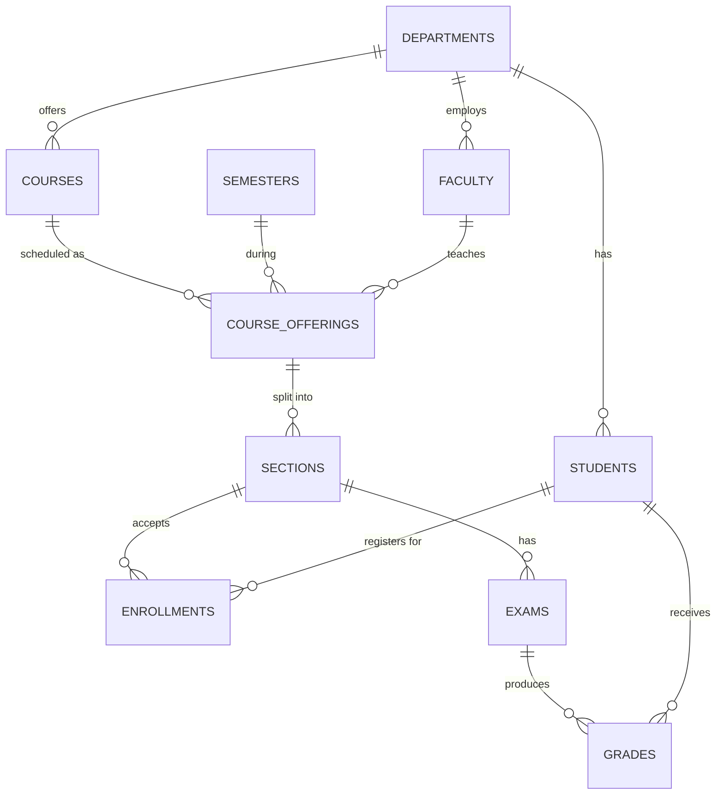

<p align="center">
  
  
  
  
</p>

<h1 align="center">📘 Student Management System</h1>

<p align="center">
  <strong>A large-scale relational academic database built with PostgreSQL</strong>
</p>

<p align="center">
  
  
  
  
</p>

---

## 📋 Table of Contents

- [🔭 Overview](#-overview)
- [🏗️ Database Architecture](#️-database-architecture)
- [📊 Dataset Scale](#-dataset-scale)
- [🔗 Entity-Relationship Diagram](#-entity-relationship-diagram)
- [🧬 Schema Design](#-schema-design)
- [⚙️ Data Generation Strategy](#️-data-generation-strategy)
- [🔍 Analytical Queries](#-analytical-queries)
- [📁 Repository Structure](#-repository-structure)
- [🚀 Getting Started](#-getting-started)
- [🧠 SQL Concepts Demonstrated](#-sql-concepts-demonstrated)
- [🎯 Learning Objectives](#-learning-objectives)
- [🛠️ Technologies Used](#️-technologies-used)
- [📈 Future Improvements](#-future-improvements)

---

## 🔭 Overview

This project implements a **relational academic database system** using **PostgreSQL**, designed to simulate a realistic, large-scale university environment.

The system models core academic entities — **students**, **departments**, **courses**, **faculty members**, **enrollments**, **examinations**, and **grades** — all connected through normalized foreign-key relationships. The dataset is generated **synthetically** using PostgreSQL's built-in functions to produce **100,000+ student records** and **hundreds of thousands** of related rows across 10 tables.

### 💡 What This Project Demonstrates

| Skill Area | Description |
|:---|:---|
| 🏗️ **Relational Design** | Normalized schema modeling with primary & foreign keys |
| 📦 **Large Dataset Generation** | Programmatic data seeding via `generate_series()` |
| 📊 **Analytical SQL** | Complex multi-table JOINs, aggregations & ranking |
| 🔒 **Data Integrity** | CHECK constraints, UNIQUE constraints & referential integrity |
| ⚡ **Performance** | Strategic indexing for query optimization |

> This project serves as a **foundation exercise** for database engineering and data analytics, forming the first module in a progressive series of SQL projects.

---

## 🏗️ Database Architecture

The schema models relationships commonly found in **academic information systems**. It follows a clean hierarchical structure where top-level entities (Departments) cascade into progressively more granular data (Grades).

### 🧩 Core Entities

| # | Entity | Purpose |
|:-:|:---|:---|
| 1 | 🏛️ **Departments** | Academic divisions (CS, Math, Physics, etc.) |
| 2 | 🎓 **Students** | Student records with personal & academic info |
| 3 | 👨‍🏫 **Faculty** | Professors assigned to departments |
| 4 | 📚 **Courses** | Courses offered by each department |
| 5 | 📅 **Semesters** | Academic time periods (Spring/Fall + Year) |
| 6 | 📋 **Course Offerings** | Courses scheduled in a specific semester by a professor |
| 7 | 🏫 **Sections** | Individual class sections with capacity limits |
| 8 | ✍️ **Enrollments** | Student-to-section registrations |
| 9 | 📝 **Exams** | Midterm & Final exams per section |
| 10 | 📊 **Grades** | Student scores on specific exams |

---

## 📊 Dataset Scale

The project simulates a university with the following **approximate dataset size**, all generated programmatically:

| Table | 📦 Records | Description |
|:---|---:|:---|
| `students` | **100,000** | Full student roster with unique IDs, emails & ages |
| `enrollments` | **300,000** | Student-section registrations |
| `grades` | **200,000** | Exam scores (0–100 scale) |
| `exams` | **2,000** | Midterm & Final exams |
| `sections` | **1,000** | Class sections with capacity |
| `course_offerings` | **500** | Semester-specific course schedules |
| `courses` | **100** | Academic courses (3–5 credits) |
| `faculties` | **40** | Professors across departments |
| `departments` | **8** | Academic departments |
| `semesters` | **6** | Spring/Fall semesters (2022–2024) |

> 📈 **Total Records: ~603,000+** across all tables

---

## 🔗 Entity-Relationship Diagram

The following diagram illustrates the **foreign key relationships** between all 10 tables:



### 🔑 Key Relationships at a Glance

```
departments.department_id  ──►  students.department_id
departments.department_id  ──►  courses.department_id
departments.department_id  ──►  faculties.department_id
courses.course_id          ──►  course_offerings.course_id
semesters.semester_id      ──►  course_offerings.semester_id
faculties.faculty_id       ──►  course_offerings.faculty_id
course_offerings.offering_id ──► sections.offering_id
sections.section_id        ──►  enrollments.section_id
sections.section_id        ──►  exams.section_id
students.student_id        ──►  enrollments.student_id
exams.exam_id              ──►  grades.exam_id
students.student_id        ──►  grades.student_id
```

---

## 🧬 Schema Design

The schema follows **relational normalization principles** to ensure data integrity and minimize redundancy.

### 🔐 Integrity Constraints Used

| Constraint Type | Example | Purpose |
|:---|:---|:---|
| `PRIMARY KEY` | `student_id SERIAL PRIMARY KEY` | Unique row identifier |
| `FOREIGN KEY` | `REFERENCES departments(department_id)` | Referential integrity |
| `UNIQUE` | `email VARCHAR(120) UNIQUE` | No duplicate emails |
| `CHECK` | `CHECK (age BETWEEN 17 AND 35)` | Domain validation |
| `NOT NULL` | `department_name VARCHAR(100) ... NOT NULL` | Required fields |
| `DEFAULT` | `DEFAULT CURRENT_TIMESTAMP` | Auto-set values |

### 📄 Sample Table Definition

```sql
CREATE TABLE students (
    student_id      SERIAL PRIMARY KEY,
    student_number  VARCHAR(20) UNIQUE NOT NULL,
    first_name      VARCHAR(50),
    last_name       VARCHAR(50),
    email           VARCHAR(120) UNIQUE,
    age             INT CHECK (age BETWEEN 17 AND 35),
    department_id   INT REFERENCES departments(department_id),
    enrollment_year INT,
    created_at      TIMESTAMP DEFAULT CURRENT_TIMESTAMP
);
```

### 📇 Strategic Indexes

Performance-optimized indexes are defined in `index.sql` for the most frequently queried columns:

```sql
CREATE INDEX idx_students_department ON students(department_id);
CREATE INDEX idx_enrollments_student ON enrollments(student_id);
CREATE INDEX idx_enrollments_section ON enrollments(section_id);
CREATE INDEX idx_sections_offering   ON sections(offering_id);
CREATE INDEX idx_grades_exam         ON grades(exam_id);
```

> ⚡ These indexes **dramatically speed up** JOIN operations on the large enrollment and grades tables.

---

## ⚙️ Data Generation Strategy

Large datasets are generated **programmatically** inside `insert_data.sql` using native PostgreSQL functions — no external scripts needed.

### 🛠️ Key Techniques

| Technique | Function | Usage |
|:---|:---|:---|
| **Series Generation** | `generate_series(1, N)` | Create N rows in one statement |
| **Randomization** | `RANDOM()` | Assign random foreign keys & values |
| **Type Casting** | `::INT` | Convert floats to integers |
| **String Building** | `'prefix' \|\| gs` | Generate unique names / emails |
| **Zero-Padding** | `LPAD(gs::text, 6, '0')` | Format student numbers: `UNI000001` |
| **Modular Arithmetic** | `gs % 5` | Distribute records evenly |
| **Conditional Logic** | `CASE WHEN ... THEN` | Random midterm/final exam types |

### 📝 Example — Generating 100K Students

```sql
INSERT INTO students (
    student_number, first_name, last_name,
    email, age, department_id, enrollment_year
)
SELECT
    'UNI' || LPAD(gs::text, 6, '0'),       -- UNI000001 ... UNI100000
    'FirstName' || gs,                       -- FirstName1 ... FirstName100000
    'LastName' || gs,                        -- LastName1 ... LastName100000
    'student' || gs || '@university.edu',    -- Unique email per student
    18 + (RANDOM() * 7)::INT,               -- Age between 18–25
    (RANDOM() * 7 + 1)::INT,                -- Random department (1–8)
    2020 + (gs % 5)                          -- Enrollment year 2020–2024
FROM generate_series(1, 100000) AS gs;
```

> 🚀 This single statement generates **100,000 student records** in seconds.

---

## 🔍 Analytical Queries

The project includes **10 advanced SQL queries** in `queries.sql` that extract meaningful insights from the dataset.

### 📊 Query Catalog

| # | Query | Key Concepts | Description |
|:-:|:---|:---|:---|
| 1 | 🏆 **Most Popular Courses** | `JOIN` × 4, `GROUP BY`, `COUNT` | Top 10 courses by enrollment count |
| 2 | 👨‍🏫 **Faculty Teaching Load** | `JOIN` × 4, `COUNT`, `ORDER BY` | Professors teaching the most students |
| 3 | 🏛️ **Department Enrollment** | `JOIN`, `GROUP BY`, `COUNT` | Student distribution across departments |
| 4 | 📚 **Most Active Students** | `JOIN`, `GROUP BY`, `COUNT` | Students enrolled in the most courses |
| 5 | 💀 **Hardest Courses** | `JOIN` × 5, `AVG`, `ASC` | Courses with the lowest average grades |
| 6 | ⭐ **Top Performers** | `JOIN`, `AVG`, `ORDER BY DESC` | Top 10 students by average score |
| 7 | 📈 **Enrollment Trends** | `GROUP BY`, `COUNT`, `ORDER BY` | Yearly student enrollment trends |
| 8 | 🏅 **Dept. Avg Grades** | `JOIN` × 2, `AVG`, `GROUP BY` | Average grade per department |
| 9 | ❌ **Failure Rates** | `FILTER (WHERE)`, `COUNT` | Courses with the highest failure rate |
| 10 | 📋 **Faculty Workload** | `COUNT(DISTINCT)`, `GROUP BY` | Number of distinct courses per professor |

### 📝 Example — Most Popular Courses

```sql
SELECT
    c.course_name,
    COUNT(e.enrollment_id) AS total_students
FROM courses c
JOIN course_offerings co ON c.course_id = co.course_id
JOIN sections s          ON co.offering_id = s.offering_id
JOIN enrollments e       ON s.section_id = e.section_id
GROUP BY c.course_name
ORDER BY total_students DESC
LIMIT 10;
```

### 📝 Example — Courses with Highest Failure Rate

```sql
SELECT
    c.course_name,
    COUNT(*) FILTER (WHERE g.score < 40) AS failed_students,
    COUNT(*) AS total_students
FROM courses c
JOIN course_offerings co ON c.course_id = co.course_id
JOIN sections s          ON co.offering_id = s.offering_id
JOIN exams ex            ON s.section_id = ex.section_id
JOIN grades g            ON ex.exam_id = g.exam_id
GROUP BY c.course_name
ORDER BY failed_students DESC
LIMIT 10;
```

> 💡 All 10 queries are ready to run — see [`queries.sql`](queries.sql) for the full list.

---

## 📁 Repository Structure

```
project-1-student-management-basic/
│
├── 📄 schema.sql            # Table definitions with constraints & relationships
├── 📄 insert_data.sql        # Synthetic data generation (100K+ records)
├── 📄 queries.sql            # 10 analytical SQL queries
├── 📄 index.sql              # Performance indexes for large tables
├── 📄 dlt.sql                # Cleanup / deletion scripts
├── 📄 student_management.sql # Entry point / DB creation script
├── 📄 main.py                # Python utility script
├── 📄 pyproject.toml         # Python project config
├── 📄 .gitignore             # Git ignore rules
└── 📄 README.md              # ← You are here
```

---

## 🚀 Getting Started

### ✅ Prerequisites

| Requirement | Version |
|:---|:---|
| 🐘 PostgreSQL | 14+ recommended |
| 💻 psql CLI | Included with PostgreSQL |
| 🖥️ Any SQL client | pgAdmin, DBeaver, DataGrip, etc. |

### 📦 Setup Instructions

**1️⃣ Clone the repository**

```bash
git clone https://github.com/your-username/sql-data-systems-projects.git
cd sql-data-systems-projects/project-1-student-management-basic
```

**2️⃣ Create the database**

```bash
psql -U postgres -c "CREATE DATABASE student_management;"
```

**3️⃣ Run the schema**

```bash
psql -U postgres -d student_management -f schema.sql
```

**4️⃣ Create indexes**

```bash
psql -U postgres -d student_management -f index.sql
```

**5️⃣ Seed the data** *(this may take a few seconds for 600K+ rows)*

```bash
psql -U postgres -d student_management -f insert_data.sql
```

**6️⃣ Run analytical queries**

```bash
psql -U postgres -d student_management -f queries.sql
```

> 🎉 **That's it!** You now have a fully populated university database ready for exploration.

---

## 🧠 SQL Concepts Demonstrated

### 📐 Data Definition (DDL)

| Concept | Usage |
|:---|:---|
| `CREATE TABLE` | Define 10 normalized tables |
| `PRIMARY KEY` | Unique row identifiers via `SERIAL` |
| `FOREIGN KEY` | 12 referential integrity constraints |
| `CHECK` | Domain validation (age, score ranges) |
| `UNIQUE` | Prevent duplicate emails & student numbers |
| `CREATE INDEX` | Optimize JOIN performance |

### 📝 Data Manipulation (DML)

| Concept | Usage |
|:---|:---|
| `INSERT ... SELECT` | Bulk data generation from `generate_series()` |
| `SELECT` | Data retrieval across all queries |
| `JOIN` | Multi-table joins (up to 5 tables deep) |
| `GROUP BY` | Aggregation for analytics |
| `ORDER BY` | Sorting results by metrics |
| `LIMIT` | Top-N result filtering |

### 📊 Analytical Functions

| Function | Purpose |
|:---|:---|
| `COUNT()` | Count enrollments, students, courses |
| `COUNT(DISTINCT)` | Unique course counts per faculty |
| `AVG()` | Average scores per student/department |
| `FILTER (WHERE ...)` | Conditional aggregation (failure rates) |
| `RANDOM()` | Randomized synthetic data |
| `generate_series()` | Bulk row generation |

---

## 🎯 Learning Objectives

This project is designed to strengthen the following **foundational database skills**:

- [x] 🏗️ **Relational Schema Design** — Modeling real-world entities as normalized tables
- [x] 🔑 **Foreign Key Relationships** — Building referential integrity across 10 tables
- [x] 📦 **Large Dataset Handling** — Generating and querying 600K+ synthetic records
- [x] 📊 **Complex Analytical Queries** — Multi-table JOINs, aggregation & ranking
- [x] 🔒 **Data Integrity** — CHECK, UNIQUE, and NOT NULL constraints
- [x] ⚡ **Query Optimization** — Strategic indexing for performance
- [x] 🧪 **Synthetic Data Generation** — Programmatic seeding with SQL functions

---

## 🛠️ Technologies Used

<p align="center">
  
  
  
  
</p>

| Technology | Role |
|:---|:---|
| 🐘 **PostgreSQL** | Primary relational database engine |
| 📝 **SQL** | Schema definition, data generation & analytics |
| 📊 **Relational Modeling** | Normalized entity-relationship design |
| 🔧 **Git** | Version control |

---

## 📈 Future Improvements

Possible extensions to expand this project:

| Enhancement | Description |
|:---|:---|
| 🏫 **Classroom Scheduling** | Room assignments, time slots & conflict detection |
| 📋 **Prerequisites** | Course dependency trees & prerequisite validation |
| 💰 **Tuition & Financials** | Fee structures, scholarships & payment tracking |
| 🤝 **Advisor System** | Faculty-student advisory relationships |
| 📅 **Attendance Tracking** | Daily attendance logs & absence reports |
| 📊 **Dashboard Integration** | Connect to Grafana / Metabase for visual analytics |
| 🔄 **Stored Procedures** | Automate enrollment & grading workflows |
| 🧪 **Unit Testing** | pgTAP-based test suites for schema validation |

---

## 📌 Purpose

> This project was developed as **part of a series** of database exercises designed to build progressively stronger skills in **SQL**, **data modeling**, and **analytical querying**.
>
> Later projects in this repository explore more advanced domains such as **e-commerce analytics**, **streaming platform data modeling**, and **agent memory systems**.

---

<p align="center">
  <sub>Built with ❤️ using PostgreSQL | Part of the <strong>SQL Data Systems Projects</strong> series</sub>
</p>
