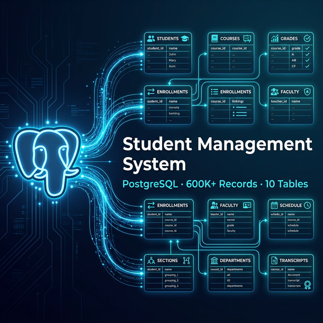
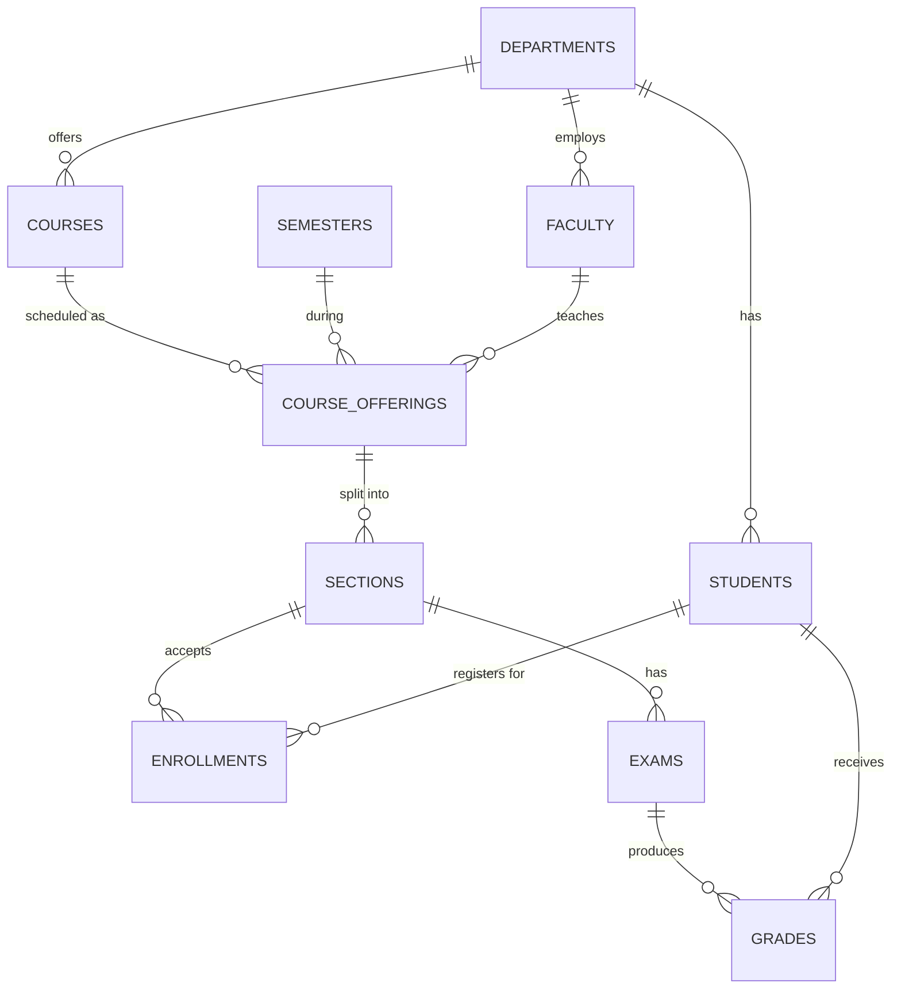

<p align="center">
  
</p>

<h1 align="center">🎓 Student Management SQL System</h1>

<h3 align="center">A Large-Scale PostgreSQL Academic Database Simulation</h3>

<p align="center">
  
  
  
  
  
  
</p>

<p align="center">
  A production-style relational database that models a complete university system —<br/>
  from student enrollment to exam grading — built entirely in <strong>SQL</strong> with <strong>PostgreSQL</strong>.<br/>
  Designed as a hands-on learning project for mastering <strong>database design</strong>, <strong>large-scale data generation</strong>, and <strong>analytical queries</strong>.
</p>

---

## ⚡ Feature Highlights

<table>
  <tr>
    <td align="center">🏛️<br/><strong>Realistic University Model</strong><br/><sub>10 normalized tables with full referential integrity</sub></td>
    <td align="center">📦<br/><strong>Large Dataset Simulation</strong><br/><sub>600K+ synthetic records generated with pure SQL</sub></td>
    <td align="center">📊<br/><strong>Advanced SQL Analytics</strong><br/><sub>10 multi-table analytical queries with JOINs & aggregations</sub></td>
  </tr>
  <tr>
    <td align="center">🔒<br/><strong>Data Integrity</strong><br/><sub>CHECK, UNIQUE, FOREIGN KEY & NOT NULL constraints</sub></td>
    <td align="center">⚡<br/><strong>Performance Optimized</strong><br/><sub>Strategic indexes on high-traffic columns</sub></td>
    <td align="center">🧠<br/><strong>Learning Focused</strong><br/><sub>Clear structure designed for progressive SQL mastery</sub></td>
  </tr>
</table>

---

## 🧠 What You Will Learn

By studying and running this project, you will build practical skills in:

| #  | Skill | What You'll Understand |
|:--:|:------|:-----------------------|
| 1  | 🏗️ **Relational Schema Design** | How to model real entities as normalized tables with proper constraints |
| 2  | 🔑 **Foreign Key Relationships** | How tables connect through referential integrity across 10 entities |
| 3  | 📦 **Large Dataset Generation** | How to use `generate_series()` and `RANDOM()` to create 600K+ rows |
| 4  | 🔗 **Multi-Table JOINs** | How to chain 3–5 JOINs to extract insights from related tables |
| 5  | 📈 **Aggregation & Analytics** | How to use `COUNT`, `AVG`, `GROUP BY`, `HAVING`, and `FILTER` |
| 6  | ⚡ **Query Optimization** | How indexes accelerate queries on large tables |
| 7  | 🧪 **Analytical Thinking** | How to ask and answer business questions through SQL |

---

## 🏛️ Database Architecture

The schema models a complete academic information system. Entities cascade from top-level **Departments** down to individual **Grades**.

```
🏛️ Departments
     │
     ├──── 🎓 Students
     │
     ├──── 👨‍🏫 Faculty
     │
     └──── 📚 Courses
                │
                └──── 📋 Course Offerings
                            │
                            └──── 🏫 Sections
                                        │
                                        ├──── ✍️ Enrollments
                                        │
                                        └──── 📝 Exams
                                                    │
                                                    └──── 📊 Grades
```

> **Departments** are the root entity. Every student, professor, and course belongs to a department. Courses are offered each semester by specific faculty, split into sections, and students enroll in those sections. Exams are given per section, and grades record each student's score.

### 🔗 Entity-Relationship Diagram



---

## 📊 Dataset Scale

The project simulates a large academic institution with **600,000+ total records**, all generated programmatically:

| Table | Records | Description |
|:------|--------:|:------------|
| `students` | **100,000** | Full student roster — unique IDs, emails, ages, departments |
| `enrollments` | **300,000** | Student-to-section registrations |
| `grades` | **200,000** | Exam scores on a 0–100 scale |
| `exams` | **2,000** | Midterm & Final exams |
| `sections` | **1,000** | Class sections with capacity limits |
| `course_offerings` | **500** | Semester-specific course schedules |
| `courses` | **100** | Academic courses (3–5 credits each) |
| `faculties` | **40** | Professors across 8 departments |
| `departments` | **8** | CS, Math, Physics, Economics, Biology, Chemistry, Data Science, EE |
| `semesters` | **6** | Spring & Fall semesters (2022–2024) |

---

## ⚙️ How the Data Is Generated

The entire dataset is created with **pure SQL** — no Python, no CSV imports, no external tools. PostgreSQL's built-in functions do all the work.

### Key Techniques

| Technique | Function | What It Does |
|:----------|:---------|:-------------|
| Series Generation | `generate_series(1, N)` | Creates N rows in a single statement |
| Randomization | `RANDOM()` | Assigns random foreign keys and values |
| Type Casting | `::INT` | Converts floats to clean integers |
| String Building | `'prefix' \|\| gs` | Generates unique names and emails |
| Zero-Padding | `LPAD(gs::TEXT, 6, '0')` | Formats student numbers: `UNI000001` |
| Conditional Logic | `CASE WHEN ... THEN` | Randomly assigns Midterm or Final exam types |

<details>
<summary>📝 <strong>View Example — Generating 100K Students</strong></summary>

<br/>

```sql
INSERT INTO students (
    student_number, first_name, last_name,
    email, age, department_id, enrollment_year
)
SELECT
    'UNI' || LPAD(gs::TEXT, 6, '0'),       -- UNI000001 ... UNI100000
    'FirstName' || gs,                      -- FirstName1 ... FirstName100000
    'LastName' || gs,                       -- LastName1 ... LastName100000
    'student' || gs || '@university.edu',   -- Unique email per student
    18 + (RANDOM() * 7)::INT,              -- Age between 18–25
    (RANDOM() * 7 + 1)::INT,               -- Random department (1–8)
    2020 + (gs % 5)                         -- Enrollment year 2020–2024
FROM generate_series(1, 100000) AS gs;
```

🚀 This single statement generates **100,000 student records** in seconds.

</details>

<details>
<summary>📝 <strong>View Example — Generating 200K Grades</strong></summary>

<br/>

```sql
INSERT INTO grades (exam_id, student_id, score)
SELECT
    (RANDOM() * 1999 + 1)::INT,            -- Random exam (1–2000)
    (RANDOM() * 99999 + 1)::INT,           -- Random student (1–100000)
    (RANDOM() * 100)::INT                   -- Score between 0–100
FROM generate_series(1, 200000);
```

Each grade is linked to a random exam and student, simulating realistic exam results.

</details>

---

## 🚀 Getting Started

Follow these steps to set up and run the project on your local machine.

### ✅ Prerequisites

| Requirement | Details |
|:---|:---|
| 🐘 **PostgreSQL** | Version 13 or higher |
| 💻 **SQL Client** | `psql` (CLI), pgAdmin, DBeaver, TablePlus, DataGrip, or VSCode SQL extensions |

> 📥 Download PostgreSQL → [postgresql.org/download](https://www.postgresql.org/download/)

---

### 📦 Step 1 — Clone the Repository

```bash
git clone https://github.com/aman-bhaskar-codes/sql-data-systems-projects.git
cd sql-data-systems-projects/project-1-student-management-basic
```

---

### 🗄️ Step 2 — Create the Database

Run the setup script:

```bash
psql -U postgres -f setup_database.sql
```

Or manually:

```sql
CREATE DATABASE student_management;
\c student_management
```

---

### 🏗️ Step 3 — Create the Tables

```bash
psql -U postgres -d student_management -f schema.sql
```

This creates all 10 tables in dependency order — departments first, grades last.

---

### ⚡ Step 4 — Create Indexes

```bash
psql -U postgres -d student_management -f indexes.sql
```

Adds strategic indexes on `department_id`, `student_id`, `section_id`, `exam_id` — essential for fast JOINs on large tables.

---

### 🌱 Step 5 — Seed the Dataset

```bash
psql -U postgres -d student_management -f seed.sql
```

> ⏱️ This may take **several seconds** — it's generating 600,000+ rows. This is expected.

---

### 🔍 Step 6 — Run Analytical Queries

```bash
psql -U postgres -d student_management -f queries.sql
```

All 10 analytical queries will execute and return results immediately.

---

### 🖥️ Using a GUI Instead?

Open the SQL files in **pgAdmin**, **DBeaver**, **TablePlus**, or **DataGrip** and execute in order:

```
1. setup_database.sql  →  Create the database
2. schema.sql          →  Create tables
3. indexes.sql         →  Add performance indexes
4. seed.sql            →  Generate 600K+ records
5. queries.sql         →  Run analytics
```

---

## 🔍 Analytical Queries

The project includes **10 production-style analytical queries**. Each demonstrates different SQL concepts.

| # | Query | Concepts | What It Finds |
|:-:|:------|:---------|:--------------|
| 1 | 🏆 **Most Popular Courses** | `JOIN` × 4, `COUNT`, `GROUP BY` | Top 10 courses by enrollment |
| 2 | 👨‍🏫 **Faculty Teaching Load** | `JOIN` × 4, `COUNT`, `ORDER BY` | Professors teaching the most students |
| 3 | 🏛️ **Dept. Enrollment** | `JOIN`, `COUNT`, `GROUP BY` | Student distribution by department |
| 4 | 📚 **Most Active Students** | `JOIN`, `COUNT`, `LIMIT` | Students enrolled in the most courses |
| 5 | 💀 **Hardest Courses** | `JOIN` × 5, `AVG`, `ASC` | Courses with lowest average scores |
| 6 | ⭐ **Top Performers** | `JOIN`, `AVG`, `DESC` | Top 10 students by average score |
| 7 | 📈 **Enrollment Trends** | `GROUP BY`, `COUNT` | Year-over-year enrollment growth |
| 8 | 🏅 **Dept. Avg Grades** | `JOIN` × 2, `AVG` | Average score per department |
| 9 | ❌ **Failure Rates** | `FILTER (WHERE)`, `COUNT` | Courses with most students scoring < 40 |
| 10 | 📋 **Faculty Workload** | `COUNT(DISTINCT)` | Number of distinct courses per professor |

<details>
<summary>🏆 <strong>View Query — Most Popular Courses</strong></summary>

<br/>

```sql
-- Finds the top 10 courses with the most enrolled students
-- by chaining: courses → offerings → sections → enrollments

SELECT
    c.course_name,
    COUNT(e.enrollment_id) AS total_students
FROM courses c
JOIN course_offerings co
    ON c.course_id = co.course_id
JOIN sections s
    ON co.offering_id = s.offering_id
JOIN enrollments e
    ON s.section_id = e.section_id
GROUP BY c.course_name
ORDER BY total_students DESC
LIMIT 10;
```

**How it works:** Starting from courses, we JOIN through offerings and sections to reach enrollments, then count how many students enrolled in each course.

</details>

<details>
<summary>💀 <strong>View Query — Hardest Courses</strong></summary>

<br/>

```sql
-- Finds the 10 courses with the lowest average exam scores
-- by chaining: courses → offerings → sections → exams → grades

SELECT
    c.course_name,
    AVG(g.score) AS avg_score
FROM courses c
JOIN course_offerings co
    ON c.course_id = co.course_id
JOIN sections s
    ON co.offering_id = s.offering_id
JOIN exams ex
    ON s.section_id = ex.section_id
JOIN grades g
    ON ex.exam_id = g.exam_id
GROUP BY c.course_name
ORDER BY avg_score ASC
LIMIT 10;
```

**How it works:** This is a 5-table JOIN chain. We traverse from courses all the way to grades, then calculate the average score per course. The lowest averages indicate the hardest courses.

</details>

<details>
<summary>❌ <strong>View Query — Failure Rates</strong></summary>

<br/>

```sql
-- Uses PostgreSQL's FILTER clause for conditional aggregation
-- Counts students scoring below 40 vs total students per course

SELECT
    c.course_name,
    COUNT(*) FILTER (WHERE g.score < 40) AS failed_students,
    COUNT(*) AS total_students
FROM courses c
JOIN course_offerings co
    ON c.course_id = co.course_id
JOIN sections s
    ON co.offering_id = s.offering_id
JOIN exams ex
    ON s.section_id = ex.section_id
JOIN grades g
    ON ex.exam_id = g.exam_id
GROUP BY c.course_name
ORDER BY failed_students DESC
LIMIT 10;
```

**How it works:** The `FILTER (WHERE ...)` clause is a PostgreSQL-specific feature that counts only rows matching a condition — here, scores below 40. This is more readable than using `CASE WHEN` inside `SUM`.

</details>

---

## 🧬 Schema Design

### 🔐 Integrity Constraints

| Constraint | Example | Purpose |
|:-----------|:--------|:--------|
| `PRIMARY KEY` | `student_id SERIAL PRIMARY KEY` | Unique row identifier |
| `FOREIGN KEY` | `REFERENCES departments(department_id)` | Referential integrity |
| `UNIQUE` | `email VARCHAR(120) UNIQUE` | No duplicate emails |
| `CHECK` | `CHECK (age BETWEEN 17 AND 35)` | Domain validation |
| `NOT NULL` | `department_name ... NOT NULL` | Required fields |
| `DEFAULT` | `DEFAULT CURRENT_TIMESTAMP` | Auto-set creation time |

<details>
<summary>📄 <strong>View Full Students Table Definition</strong></summary>

<br/>

```sql
CREATE TABLE students (
    student_id      SERIAL PRIMARY KEY,
    student_number  VARCHAR(20) UNIQUE NOT NULL,
    first_name      VARCHAR(50),
    last_name       VARCHAR(50),
    email           VARCHAR(120) UNIQUE,
    age             INT CHECK (age BETWEEN 17 AND 35),
    department_id   INT REFERENCES departments(department_id),
    enrollment_year INT,
    created_at      TIMESTAMP DEFAULT CURRENT_TIMESTAMP
);
```

This table uses 6 different constraint types to ensure data quality.

</details>

### 📇 Performance Indexes

```sql
CREATE INDEX idx_students_department ON students(department_id);
CREATE INDEX idx_enrollments_student ON enrollments(student_id);
CREATE INDEX idx_enrollments_section ON enrollments(section_id);
CREATE INDEX idx_sections_offering   ON sections(offering_id);
CREATE INDEX idx_grades_exam         ON grades(exam_id);
CREATE INDEX idx_grades_student      ON grades(student_id);
```

> ⚡ These indexes **dramatically speed up** JOIN operations on the 300K enrollment and 200K grades tables.

---

## 🧠 SQL Concepts Covered

<table>
  <tr>
    <th>Category</th>
    <th>Concepts</th>
  </tr>
  <tr>
    <td><strong>📐 Data Definition</strong></td>
    <td><code>CREATE TABLE</code> · <code>CREATE DATABASE</code> · <code>CREATE INDEX</code> · <code>PRIMARY KEY</code> · <code>FOREIGN KEY</code> · <code>CHECK</code> · <code>UNIQUE</code></td>
  </tr>
  <tr>
    <td><strong>📝 Data Manipulation</strong></td>
    <td><code>INSERT ... SELECT</code> · <code>SELECT</code> · <code>JOIN</code> · <code>GROUP BY</code> · <code>ORDER BY</code> · <code>LIMIT</code></td>
  </tr>
  <tr>
    <td><strong>📊 Analytics</strong></td>
    <td><code>COUNT()</code> · <code>COUNT(DISTINCT)</code> · <code>AVG()</code> · <code>FILTER (WHERE)</code></td>
  </tr>
  <tr>
    <td><strong>⚙️ Data Generation</strong></td>
    <td><code>generate_series()</code> · <code>RANDOM()</code> · <code>LPAD()</code> · <code>CASE WHEN</code> · <code>::INT</code> casting</td>
  </tr>
</table>

---

## 📁 Repository Structure

```
project-1-student-management-basic/
│
├── 📄 setup_database.sql    → Create the database
├── 📄 schema.sql            → Table definitions (10 tables, dependency order)
├── 📄 indexes.sql           → Performance indexes (6 indexes)
├── 📄 seed.sql              → Synthetic data generation (600K+ records)
├── 📄 queries.sql           → 10 analytical SQL queries
├── 📄 README.md             → Project documentation
└── 📁 docs/                 → Assets (banner image)
```

**Execution order:** `setup_database.sql` → `schema.sql` → `indexes.sql` → `seed.sql` → `queries.sql`

---

## 📈 Future Improvements

| Enhancement | Description |
|:---|:---|
| 🏫 **Classroom Scheduling** | Room assignments, time slots & conflict detection |
| 📋 **Course Prerequisites** | Dependency trees & prerequisite validation |
| 💰 **Tuition & Financials** | Fee structures, scholarships & payment tracking |
| 🤝 **Advisor System** | Faculty-student advisory relationships |
| 📅 **Attendance Tracking** | Daily attendance logs & absence analytics |
| 📊 **Dashboard Integration** | Connect to Grafana / Metabase for visual analytics |
| 🔄 **Stored Procedures** | Automate enrollment & grading workflows |
| 🧪 **Schema Testing** | pgTAP-based automated test suites |

---

## 📚 This Is Part of a Series

This project is the **first module** in a progressive SQL mastery series:

| # | Project | Domain | Complexity | Status |
|:-:|:--------|:-------|:-----------|:------:|
| 1 | 🎓 **Student Management System** | University Academics | ⭐⭐ | ✅ Complete |
| 2 | 🛒 **AI E-Commerce Platform** | Online Retail + AI | ⭐⭐⭐⭐ | ✅ Complete |
| 3 | 🤖 **Agent Memory Database** | AI Memory Systems | ⭐⭐⭐⭐⭐ | 🔜 Coming Soon |

> Each project builds on the skills learned in the previous one — progressing from foundational schema design to advanced analytical systems.

---

## 🤝 Contributing

Contributions, issues, and feature requests are welcome!
Feel free to check the [issues page](https://github.com/aman-bhaskar-codes/sql-data-systems-projects/issues).

## 📄 License

This project is [MIT](https://opensource.org/licenses/MIT) licensed.

---

<p align="center">
  <sub>Built with ❤️ using PostgreSQL</sub><br/>
  <sub>Part of the <strong>SQL Data Systems Projects</strong> series</sub>
</p>

<p align="center">
  <a href="https://github.com/aman-bhaskar-codes">
    
  </a>
</p>
